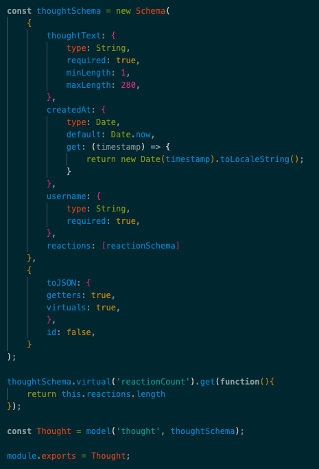

<h1 align="center"> <a href="https://youtu.be/Ndu4JQRXCAM">
Social Network API 👥</a>
</h1>

<p align="center">This Project has no front end but cooperates and functions with mongoose and mongodb.</p>

<p align="center"> For a Detailed Video Walkthrough you can follow the link in the Title of this one -> <a href= "https://youtu.be/Ndu4JQRXCAM">Video Walkthrough</a></p>

## Table of Contents

- [Description](#description)

- [Installation](#installation)
- [Usage](#usage)
- [Resources](#resources)
- [Questions](#questions)

## [License](table-of-contents)
### My project is under the following Licenses:
[](https://opensource.org/licenses/MIT)
## [Description](#table-of-contents)

This application acts a social Network API with no front end. with the routes provided and database being used, we are able to create a network where you can create a user and become friends with other users as well as create thoughts(aka posts) and people can react to them (aka comment).

### User Story

```
AS A social media startup
I WANT an API for my social network that uses a NoSQL database
SO THAT my website can handle large amounts of unstructured data
```

### Acceptance Criteria
```
GIVEN a social network API
WHEN I enter the command to invoke the application
THEN my server is started and the Mongoose models are synced to the MongoDB database
WHEN I open API GET routes in Insomnia for users and thoughts
THEN the data for each of these routes is displayed in a formatted JSON
WHEN I test API POST, PUT, and DELETE routes in Insomnia
THEN I am able to successfully create, update, and delete users and thoughts in my database
WHEN I test API POST and DELETE routes in Insomnia
THEN I am able to successfully create and delete reactions to thoughts and add and remove friends to a user’s friend list
```

## [Installation](#table-of-contents)
This application requires that you download the following packages using Node to run this application:

<p align="center">
 
<p align="center">
 
<p align="center">

<p align="center">

<p align="center">

</p>

The NPM packages are on the package.json for you to simply run this command in your terminal to install the npm pakages needed:

```
npm i
```

Once the npm packages are installed, you can then run the following command to start creating a User!:
```
npm start
```

## [Usage](#table-of-contents)

The models that are created through [Mongoose](https://mongoosejs.com/) are used to create the data base to store all of our information. 

to Start we have our Database (A.k.A. usersDB) that can store our first 2 models 


the **thoughts** model and the **users** model are the bases of how we are able to create a social network that can be used to make users and add friends as well as make thoughts or react to other users thoughts.

### User Schema 

our schema inside of the users model is to determine what kind of information we can allow it to store:


### Thought Schema 

The Thought Schema used inside of the Thought Model foler shows us what the requirements are for making a thought a.k.a like a base skeleton: 



### Reacrion Schema

The Reaction Schema is inside of the Thought model as is used as a subdocument schema in the Thought model: 


### Example Data using UsersDB on MongoDB
**thought Database**


**user Database**


## [Resources](#table-of-contents)

* [Mongoose](https://mongoosejs.com/)

* [MongoDB](https://www.mongodb.com/)

* [CRUD MongoDB](https://www.mongodb.com/docs/manual/crud/)

* [Virtuals MongoDB](https://mongoosejs.com/docs/tutorials/virtuals.html)

* [Populate Mongoose](https://mongoosejs.com/docs/populate.html)


## [Questions](#table-of-contents)

Take a look at some other work ive done on my repos from my Github:

* Github: [Lorena-RM](https://github.com/Lorena-RM)

Get in contact with me Directly within linkden or my personal email:

* Linkden: [Lorena Morales](https://www.linkedin.com/in/lorena-morales-496855240/)

* Email: [lorenarm.999@gmail.com](mailto:lorenarm.999@gmail.com)